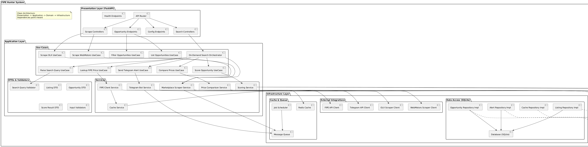
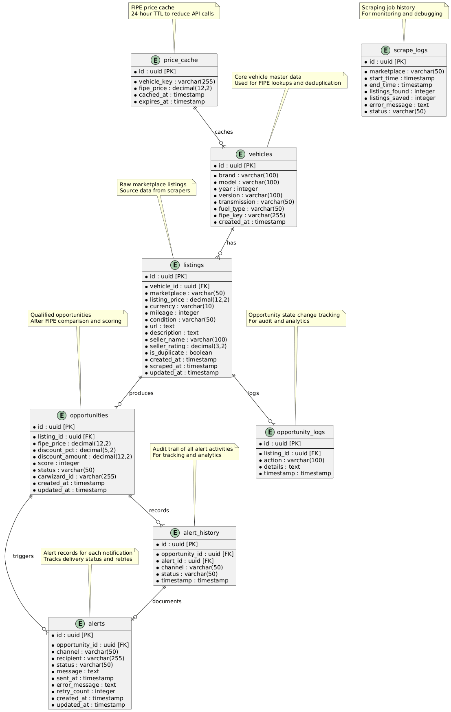

# Architecture

## Package Diagram

The system follows Clean Architecture: domain logic is isolated from web framework, database, and scraping adapters. The FastAPI app wires them together at the infra layer.

## Database ERD

SQLite with three core tables: `cars`, `fipe_references`, and `opportunities`. The opportunities view joins listing price against the FIPE reference to compute the delta.

---

## Architecture Decision Records

| ADR | Decision | Status |
|-----|----------|--------|
| [ADR-0001](./documentation/sdlc/2-edd/adr/0001-clean-architecture.md) | Use Clean Architecture | Accepted |
| [ADR-0002](./documentation/sdlc/2-edd/adr/0002-sqlite-database.md) | Use SQLite for Database | Accepted |
| [ADR-0003](./documentation/sdlc/2-edd/adr/0003-fastapi-framework.md) | Use FastAPI Framework | Accepted |
| [ADR-0004](./documentation/sdlc/2-edd/adr/0004-beautifulsoup-scraping.md) | Use BeautifulSoup4 for Web Scraping | Accepted |
| [ADR-0005](./documentation/sdlc/2-edd/adr/0005-apscheduler-jobs.md) | Use APScheduler for Background Jobs | Accepted |
| [ADR-0006](./documentation/sdlc/2-edd/adr/0006-nodriver-headless-chromium.md) | Use nodriver + Headless Chromium for WebMotors | Accepted |
