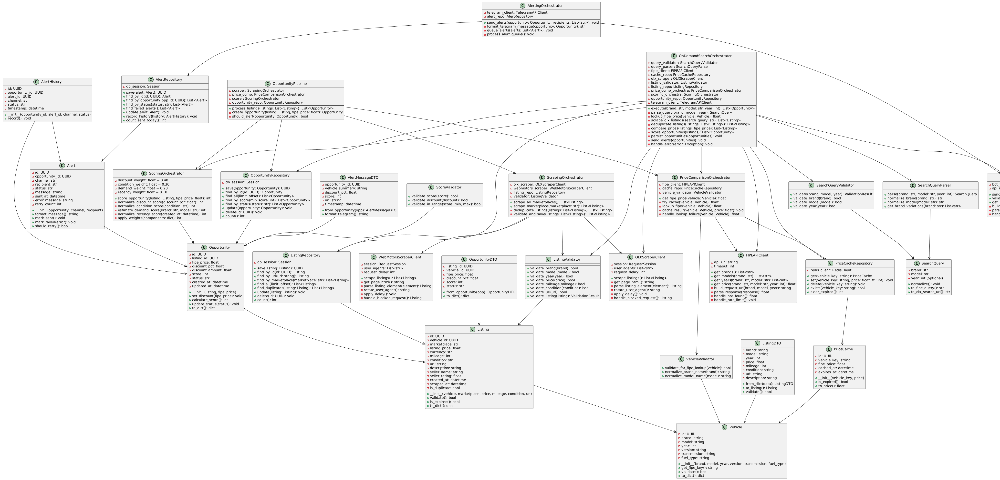

# Architecture — FIPE Hunter

## Overview

FIPE Hunter is a Python/FastAPI backend paired with a React/TypeScript frontend, deployed as a single Docker service on Render. The system follows Clean Architecture: domain logic (price comparison, opportunity scoring) is isolated from the web framework, scraping adapters, and database. FastAPI wires all layers together at the composition root. The key constraint is avoiding detection by the WebMotors CDN while scraping at scale, which drove the headless Chromium + nodriver approach.

## Package Diagram — Clean Architecture Layers

The system enforces strict dependency inversion: domain has zero external dependencies, application depends only on domain, adapters depend on domain + application, infrastructure wires everything at the composition root.

## Database ERD

PostgreSQL (Neon) with three core tables: `listings`, `fipe_references`, and `opportunities`. The opportunities table joins listing price against the FIPE reference to compute the discount delta and score.

## Class Diagram

Domain entities, value objects, and their relationships — Listing, Opportunity, Discount, Score, and the port interfaces they implement.

## Architecture Decision Records

| # | ADR | Decision | Status |
|---|-----|----------|--------|
| 1 | [ADR-0001](./documentation/adrs/0001-clean-architecture.md) | Use Clean Architecture (Hexagonal/Ports & Adapters) | Accepted |
| 2 | [ADR-0002](./documentation/adrs/0002-sqlite-database.md) | SQLite for development; Neon PostgreSQL for production | Accepted |
| 3 | [ADR-0003](./documentation/adrs/0003-fastapi-framework.md) | FastAPI as the web framework and composition root | Accepted |
| 4 | [ADR-0004](./documentation/adrs/0004-beautifulsoup-scraping.md) | BeautifulSoup4 for HTML parsing layer | Accepted |
| 5 | [ADR-0005](./documentation/adrs/0005-apscheduler-jobs.md) | APScheduler for background scrape jobs | Accepted |
| 6 | [ADR-0006](./documentation/adrs/0006-nodriver-headless-chromium.md) | nodriver + headless Chromium for WebMotors scraping | Accepted |
| 7 | [ADR-0007](./documentation/adrs/0007-fipe-catalog-caching-strategy.md) | In-memory + DB cache for FIPE catalog data | Accepted |
