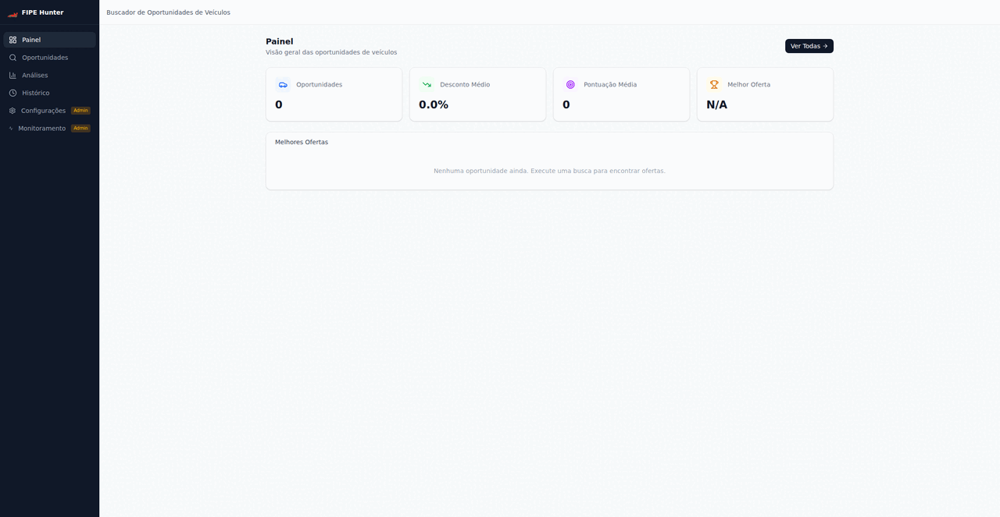

# Fipe Hunter

Find underpriced used cars by comparing dealer listings against FIPE reference prices — built for the Brazilian used car market.

[**Live Demo**](https://fipe-hunter-api.onrender.com) | [Architecture](./ARCHITECTURE.md)

---

## Demo

## What It Does

FIPE Hunter scrapes car listings from WebMotors, compares each price against the official FIPE reference table, and surfaces deals where the asking price is below market value. Users filter by make, model, and year; the system shows the price delta and highlights the best opportunities.

## Tech Stack

| Layer | Technology |
|-------|-----------|
| Frontend | React, TypeScript, Vite |
| Backend | FastAPI, Python |
| Database | SQLite |
| Scraping | BeautifulSoup, nodriver (headless Chromium) |
| Scheduling | APScheduler |
| Deployment | Render (Docker multi-stage, single service) |

## Key Technical Decisions

- **Image Proxy for CDN Bypass:** WebMotors CDN blocks cross-origin requests — server-side proxy at `/api/proxy/image` with spoofed `Referer` header and 24h cache; zero frontend auth complexity
- **Responsive Filter Layout:** Sticky 280px sidebar on desktop keeps filters always visible; mobile uses an on-demand bottom sheet overlay so car listings stay as hero content
- **Empty State Over Stale Data:** Page load shows a search prompt instead of stale records — results only appear after an explicit user search, matching the "I haven't searched yet" mental model
- **Single-Service Deployment:** Vite builds as a Docker multi-stage step (Node.js → static assets copied into Python image); FastAPI serves the SPA via `StaticFiles` — one Render service, one URL, zero CORS config

## Architecture

See [ARCHITECTURE.md](./ARCHITECTURE.md) for component diagrams, ERD, and Architecture Decision Records.

## Monorepo Origin

Extracted from a private monorepo. Shared packages remain in the monorepo; the live demo runs the complete stack. Built solo. AI tooling used to accelerate documentation, scaffolding, and code review. The architecture decisions and running system are original.
